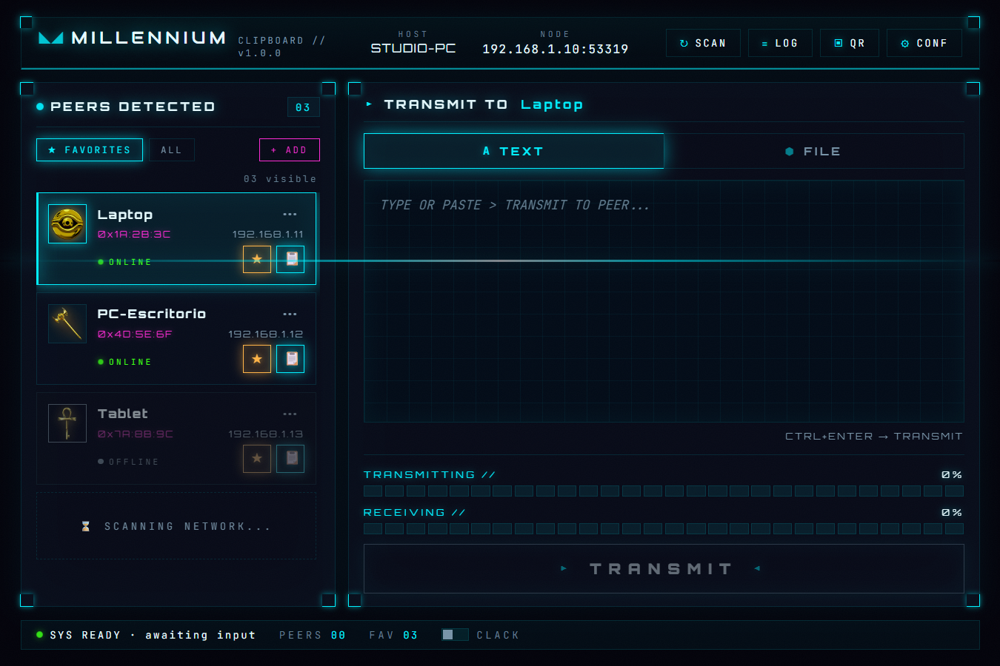

# ◣◢ Millennium Clipboard

**Share text, files and your clipboard between Windows and Android on the same Wi-Fi.**
No cloud. No accounts. Nothing ever leaves your local network.

[**⬇ Download for Windows**](https://github.com/guidocameraeq/Millennium-Clipboard/releases/latest) · [**🌐 Landing**](https://guidocameraeq.github.io/Millennium-Clipboard) · Windows 10/11 &amp; Android

## What it is

Moving a snippet or a few files between your own devices — PC↔PC or PC↔phone on the same network — should be trivial. Millennium Clipboard discovers your other devices on the LAN and lets you send text or files to a specific one, peer-to-peer. Mark trusted devices as favorites; keep the clipboard in sync if you want.

Everything runs on your local network. There is no server in the middle and no account to create.

## Features

- **LAN-only, zero cloud** — devices talk directly over your Wi-Fi; your data never touches a third-party server.
- **Text, files &amp; clipboard** — send a note, a batch of files, or keep the clipboard synced between machines.
- **Auto-discovery** — peers find each other over mDNS; add one by IP or scan a QR on locked-down networks.
- **Encrypted &amp; pinned** — every transfer runs over HTTPS with a self-signed certificate per device, pinned by fingerprint.
- **Windows &amp; Android** — send both ways, straight into your Downloads.
- **Auto-updates** — new versions verify their own SHA-256 before installing.

## Download

Grab the latest `millennium-clipboard.exe` from [**Releases**](https://github.com/guidocameraeq/Millennium-Clipboard/releases/latest) — no installer, just run it. Both devices need to be on the same Wi-Fi network.

## Stack

- **[Tauri 2](https://v2.tauri.app/)** — Rust backend, vanilla JS/CSS frontend (no framework, no bundler), ~10 MB binary.
- **Discovery:** mDNS (`_millennium._tcp.local`) + UDP broadcast.
- **Transport:** HTTPS (axum + rustls) with self-signed per-device certificates and fingerprint pinning.
- **Targets:** Windows `.exe` and Android `.apk`.

## License

TBD.
