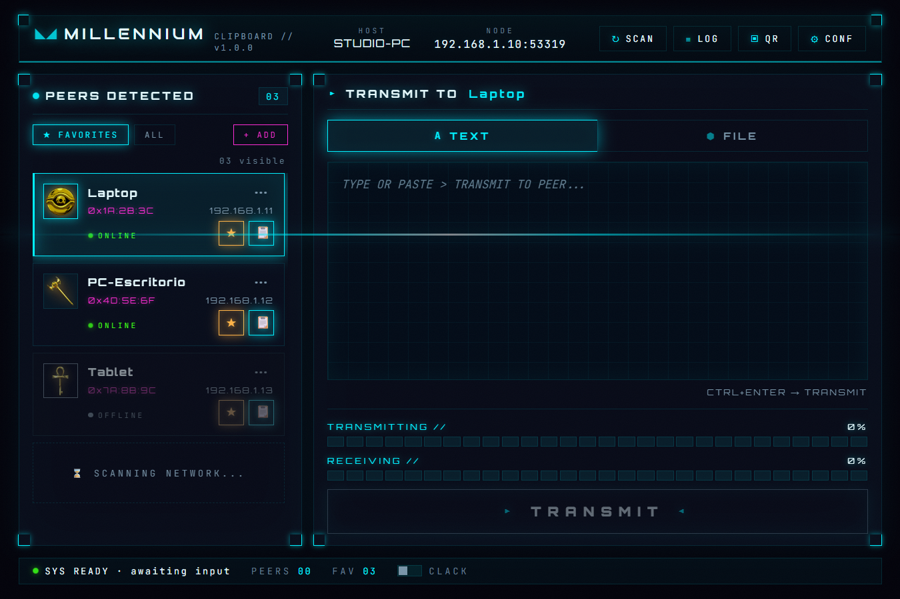

# ◣◢ Millennium

**Two Windows tools in one app.** Share your clipboard and files across your LAN, and manage your monitors — no cloud, no accounts, nothing ever leaves your local network.

[**⬇ Download for Windows**](https://github.com/guidocameraeq/Millennium/releases/latest) · [**🌐 Landing**](https://guidocameraeq.github.io/Millennium) · Windows 10/11 &amp; Android

## What it is

Millennium bundles two small, sharp Windows tools behind one switch:

- **📋 Clipboard** — share text, files and your clipboard between your devices (PC↔PC or PC↔phone) on the same Wi-Fi, peer-to-peer.
- **🖥️ Displays** — manage your monitors: save layouts as one-click scene-profiles, flip a TV on and off with an auto-revert safety net, route your audio to the right output, and more.

Everything runs on your local network. There is no server in the middle and no account to create.

## 📋 Clipboard

- **LAN-only, zero cloud** — devices talk directly over your Wi-Fi; your data never touches a third-party server.
- **Text, files &amp; clipboard** — send a note, a batch of files, or keep the clipboard synced between machines.
- **Auto-discovery** — peers find each other over mDNS; add one by IP or scan a QR on locked-down networks.
- **Encrypted &amp; pinned** — every transfer runs over HTTPS with a self-signed certificate per device, pinned by fingerprint.
- **Windows &amp; Android** — send both ways, straight into your Downloads.
- **Auto-updates** — new versions verify their own SHA-256 before installing.

## 🖥️ Displays (Windows only)

- **Attach/detach a TV with one button** — with an auto-revert safety net: every display change starts a confirm-or-revert countdown, so if something goes wrong it rolls back on its own. You never end up with a dead screen or no rescue panel.
- **One-click scene-profiles** — save a whole setup (monitor layout + audio + apps) and apply it in one click: *play on the TV*, *work*, *movies*.
- **Sound follows the screen** — each profile can route audio to a different output, across all three Windows roles (media, comms, system).
- **Apply your setup without opening the app** — pick a startup profile and assign a global hotkey per profile.
- **Drag-to-arrange + live watcher** — a Windows-style canvas that snaps monitors to their edges; plugging or unplugging a display refreshes the list instantly (event-driven, ~0% CPU at rest).

Powered by the Windows **CCD** API (from the [Monarch](https://github.com/guidocameraeq/Monarch) project): it validates a change *before* applying it and verifies it by re-reading the monitors afterwards, with a rescue ladder and auto-rollback — so it can flip a Smart TV on and off over HDMI without ever leaving you stranded.

## Download

Grab the latest `millennium-clipboard.exe` from [**Releases**](https://github.com/guidocameraeq/Millennium/releases/latest) — no installer, just run it. For the Clipboard, both devices need to be on the same Wi-Fi network. Displays is Windows-only.

## Stack

- **[Tauri 2](https://v2.tauri.app/)** — Rust backend, vanilla JS/CSS frontend (no framework, no bundler), ~10 MB portable binary.
- **Clipboard** — mDNS discovery (`_millennium._tcp.local`) + UDP broadcast; HTTPS transport (axum + rustls) with self-signed per-device certificates and fingerprint pinning.
- **Displays** — Windows CCD API via `raw-dylib`, on top of a vendored `monarch` crate; dry-run + verify + auto-rollback around every change.
- **Targets:** Windows `.exe` and Android `.apk` (Clipboard only on Android).

## License

TBD.
